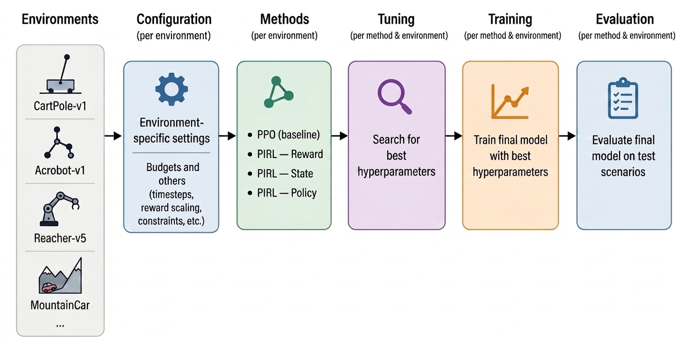

# A Controlled Benchmark for Physics-Prior Injection Strategies in PPO-based RL

This repository accompanies the master thesis *"Benchmarking Physics-Informed Reinforcement Learning Across Simulated Physical Domains''* and contains the full experimental codebase used to evaluate and compare three physics-prior integration strategies — **reward shaping**, **state augmentation**, and **policy augmentation** — against a non-physics-informed PPO baseline within standard Gymnasium environments.

These physics-prior integration strategies are drawn from the taxonomy proposed by Banerjee et al. (2025).

## 1. What this comparison protocol does

Existing physics-informed reinforcement learning (PIRL) studies vary the RL algorithm, the physics prior, and the evaluation protocol all at once, making it impossible to attribute observed differences to *where* a physics prior is injected. This benchmark isolates the integration point by holding everything else fixed:

- **Fixed model-free base algorithm:** PPO (Schulman et al., 2017).
- **Fixed physics prior:** the physics prior is instantiated as a function of state or action variables. A single prior is instantiated per environment and used identically across all integration strategies considered, so that they all carry the same physical information and only the injection point varies (see Section 8, Adding new environments and physics priors).
- **Fixed, unified tuning, training and evaluation protocols.**
- **Only the integration strategy varies:** reward shaping, state augmentation, and policy augmentation.

Each strategy is evaluated along three dimensions — final performance, sample efficiency, and cross-seed outcome stability.

Figure 1 below illustrates the pipeline for evaluating and comparing methods within a single environment. By default, four Gymnasium environments are available to work with ([CartPole-v1](https://gymnasium.farama.org/environments/classic_control/cart_pole/), [Acrobot-v1](https://gymnasium.farama.org/environments/classic_control/acrobot/), [Reacher-v5](https://gymnasium.farama.org/environments/mujoco/reacher/), [MountainCarContinuous-v0](https://gymnasium.farama.org/environments/classic_control/mountain_car_continuous/)):


*Figure 1. Pipeline for running an evaluation and comparison of PIRL methods.*

It is important to note that you can only use environments that are compatible with [Gymnasium](https://gymnasium.farama.org/) framework.

## 2. Physics prior integration strategies or methods

This project includes the following strategies for injecting a physics prior into an environment.

| Method | Injection Point | Formulation |
|---|---|---|
| Reward Shaping (`PIRL_REWARD`)| Reward computation | `r' = r - α·φ(s,a)` |
| State Augmentation (`PIRL_STATE`)| Observation preprocessing | `s' = [s, φ(s,a)]` |
| Policy Augmentation (`PIRL_POLICY`) | PPO loss (update step) | `L = L_PPO + α·E[φ(s,a)]` |

where `φ(s,a)` is the physics prior and `α` is the prior weight. Reward shaping and state augmentation are implemented as Gymnasium wrappers; policy augmentation is a custom Stable-Baselines3 callback. The base environment dynamics and the PPO algorithm itself are never modified.

The baseline (PPO) method without any prior physics is called `RL_PURE` and is the [PPO implementation](https://stable-baselines3.readthedocs.io/en/master/modules/ppo.html#ppo) of Stable-Baselines3.


## 3. Repository structure

- `configs/`: YAML configs for each benchmark environment.
- `experiments/`: generated experiment outputs, analysis, plots, and logs.
- `src/`: implementation modules.
  - `env_utils.py`: environment creation and wrapper logic.
  - `physics.py`: environment-specific physics priors (φ functions).
  - `wrappers.py`: Gymnasium wrappers for PIRL_REWARD and PIRL_STATE.
  - `tuning.py`: tuning protocol based on [Optuna](https://optuna.readthedocs.io/en/stable/index.html) framework.
  - `train.py`: final training protocol using tuned hyperparameters.
  - `evaluate.py`: evaluation protocol for trained policies.
  - `callbacks.py`: custom callbacks used by PIRL_POLICY and training/evaluation.
- `run_experiment.py`: orchestrates tuning, training, and evaluation phases from a single config.
- `requirements.txt`: Python dependencies.


## 4. Installation

```bash
git clone https://github.com/ag-din/ppo-pirl-benchmark.git
cd ppo-pirl-benchmark
python -m venv .venv
source .venv/bin/activate        # Windows: .venv\Scripts\activate
pip install -r requirements.txt
```

## 5. Quick start


1. Choose an available environment config from `configs/` (e.g. `CartPole-v1.yaml`).

2. Run the experiment pipeline with your preferred method. The methods available are `RL_PURE`, `PIRL_REWARD`, `PIRL_POLICY`, and `PIRL_STATE`.

Running an experiment uses the environment configuration to execute tuning, training, and evaluation consecutively for that environment and method. Individual phases can also be run on their own as needed, provided the preceding phases have already been completed.

Example: **run all**, the tuning, training, and evaluation phases.
```bash
python run_experiment.py --config configs/CartPole-v1.yaml --method RL_PURE
```

Example: **run only** the tuning phase (the same applies to `training` and `evaluation`, as long as the preceding phases have already been run).
```bash
python run_experiment.py --config configs/CartPole-v1.yaml --method RL_PURE --only tuning
```

Example: **skip** a phase; e.g. skip tuning and run only training and evaluation, reusing existing tuning results.
```bash
python run_experiment.py --config configs/CartPole-v1.yaml --method RL_PURE --skip tuning
```

By default, all artefacts (tuning studies, checkpoints, learning curves, and evaluation summaries) are written to `experiments/` in current directory. You can change this location with the `--experiments-dir` flag:
```bash
python run_experiment.py --config configs/CartPole-v1.yaml --method RL_PURE --experiments-dir /path/to/results
```


For the environments already configured in this benchmark, simple physics priors based on environment variables are provided. The priors are defined in the `/src/physics.py` file. For example, the prior for CartPole-v1 is shown below. It can be modified within the function itself, or replaced by proposing a different prior based on the environment's observations and/or actions.

```python
def phi_cartpole(obs, action=None):
    """
    Penalty for CartPole-v1.

    This prior penalizes large pole angles and angular velocities, which
    correspond to physically unstable states. The returned value is the
    sum of the squared pole angle and angular velocity, encouraging the
    agent to keep the pole upright and stable.
    """

    pole_angle = obs[2]
    pole_ang_vel = obs[3]

    return float(pole_ang_vel**2 + pole_angle**2)
```

When proposing a new prior, it must be registered in the same file:

```python
# Registry — env_name → φ function
PHI_REGISTRY = {
    "CartPole-v1":                phi_cartpole,    # <-- Write the function name
    ...
}
```

Once the experiments for the desired PIRL methods have been executed for a given environment, you can obtain the comparison results across the evaluated learning dimensions
by running the following command:

```bash
python run_comparison.py --env ENV_NAME
```

## 6. Output structure

Experiment outputs are stored in:

```text
experiments/{env_name}/{method}/
  analysis/
  tuning/
  training/
  evaluation/
```

Important files:

- `tuning/trials.jsonl`: trial-level tuning results.
- `tuning/best_params.json`: best hyperparameters from tuning.
- `tuning/summary.json`: tuning summary stats.
- `training/`: training logs, model checkpoints, and evaluation curves.
- `evaluation/`: final evaluation results and plots.
- `analysis/`: combined learning curves and performance profiles.


## 7. Environment configuration files

Each YAML config includes:

- `env_name`: Gymnasium environment id.
- `n_envs`: number of parallel environments.
- `methods_available`: supported PIRL/RL methods.
- `tuning`: tuning settings, including trials, timesteps, seeds, evaluation episodes, and Optuna options.
- `training`: training settings, including timesteps, seeds, episode evaluation frequency, and eval episodes.
- `evaluation`: final evaluation settings, including number of episodes, deterministic policy flag, evaluation seed, video saving, and scoring bounds.

Example:

```yaml
# ──────────────────────────────────────────────────────────────
# Environment configuration template — PPO-PIRL Benchmark
#
# Copy this file to configs/<Env-Name>.yaml and fill in the values
# for the target environment. All four phases (tuning, training,
# evaluation, analysis) read from this file.
# ──────────────────────────────────────────────────────────────

# ── Experiment ────────────────────────────────
env_name:           "NewEnv-vX"          # Gymnasium id, e.g. "CartPole-v1"
n_envs:             6                    # parallel envs for rollout collection
methods_available:  ["RL_PURE", "PIRL_REWARD", "PIRL_POLICY", "PIRL_STATE"]
# RL_PURE       = non-physics-informed PPO baseline
# PIRL_REWARD   = reward shaping        r' = r - α·φ(s,a)
# PIRL_STATE    = state augmentation    s' = [s, φ(s,a)]   (α fixed to 1.0)
# PIRL_POLICY   = policy augmentation   L = L_PPO + α·E[φ(s,a)]

# ── Tuning (Phase 1) ──────────────────────────
tuning:
  n_trials:         20                   # Optuna trials per (env, method)
  timesteps:        50_000               # per-env tuning budget
  n_eval_episodes:  50                   # deterministic eval per trial-seed
  seeds:            [1, 2, 3]            # tuning seeds (3–5 recommended)
  sampler_seed:     42                   # Optuna TPE sampler seed
  eval_seed:        43                   # fixed eval-env seed during tuning
  n_jobs:           10                   # parallel Optuna workers
  direction:        "maximize"           # objective: median episodic return

# ── Training (Phase 2) ────────────────────────
training:
  timesteps:        120_000              # full per-env training budget
  seeds:            [11, 12, 13, 14, 15, 16, 17, 18]   # 8 training seeds
  n_eval_episodes:  500                  # episodes per checkpoint
  eval_freq:        2_500                # checkpoint interval (timesteps)

# ── Evaluation (Phase 3) ──────────────────────
evaluation:
  n_eval_episodes:  1_000                # episodes per seed
  eval_seed:        9999                 # held-out eval seed (≠ train seeds)
  deterministic:    true
  n_video_episodes: 3                    # episodes recorded for inspection
  n_bootstrap:      10_000               # bootstrap resamples for CIs
  score_min:        -100.0               # normalisation lower bound (per env)
  score_max:        0.0                  # normalisation upper bound (per env)
```


## 8. Adding new environmnets and physics priors

To add a new Gymnasium-compatible environment:

**1. Add a configuration file in `configs/`.**

Copy the above template to `configs/<Env-Name>.yaml` and fill in the values for the target environment.

**2. Implement a physics prior in `src/physics.py`.**

Add a function that computes physics prior `φ(s,a)` for the new environment:

```python
def phi_newenv(obs: np.ndarray, action: Optional[np.ndarray] = None) -> float:
    """
    Physics prior for the new environment.

    Args:
        obs:    observation vector from the environment.
        action: action taken (optional; only needed if the prior
                depends on the action).

    Returns:
        The scalar prior value φ(s, a).
    """
    # Define the prior here, e.g. a squared deviation from a
    # reference operating point: φ = Σ_i ((x_i - c_i) / d_i)^2
    return prior
```

**3. Register the new environment in `PHI_REGISTRY`.**

In the same file (`src/physics.py`), map the environment id to its prior function:

```python
PHI_REGISTRY = {
    "MountainCarContinuous-v0": phi_mountaincar,
    "Reacher-v5":               phi_reacher,
    "Acrobot-v1":               phi_acrobot,
    "CartPole-v1":              phi_cartpole,
    "NewEnv-vX":                phi_newenv,    # <-- new entry
}
```

## 9. Thesis experiment results (`experiments_results` folder)

The `experiments_results/` folder contains already-run outputs for the four environments listed above. Each environment directory is organized by method:

```text
experiments_results/{env_name}/
  RL_PURE/
  PIRL_REWARD/
  PIRL_STATE/
  PIRL_POLICY/
```

Inside each method subfolder:

- `tuning/`
  - `trials.jsonl`: trial-level Optuna tuning data.
  - `best_params.json`: best hyperparameter values discovered by tuning.
  - `summary.json`: high-level tuning statistics.
  - `param_importance.png`: fANOVA hyperparameter importance plot.

- `training/`
  - `training_summary.json`: aggregated training results across seeds.
  - `training_results_aggregated.jsonl`: seed-level training results.
  - `logs_seed_{seed}/`: per-seed model checkpoints and eval logs.

- `evaluation/`
  - `data/`
    - `seed_{seed}.jsonl`: evaluation metrics for each seed.
    - `performance_profile.json`: RL performance profile output.
    - `rliable_summary.json`: robust evaluation metric summary.
  - `plots/`
    - `performance_profile.png`: performance profile figure.
    - `distribution_*.png`: return distributions for each seed and aggregate.
  - `videos/`: episode recordings from evaluation runs.

- `analysis/`
  - `plots/`
    - `learning_curves.png`: combined learning curves
    - `performance_profiles.png`: combined performance profiles


## References

Banerjee, C., Nguyen, K., Fookes, C., & Raissi, M. (2025). A survey on physics-informed reinforcement learning: Review and open problems. Expert Systems With Applications, 287, Article 128166. https://doi.org/10.1016/j.eswa.2025.128166

Schulman, J., Wolski, F., Dhariwal, P., Radford, A., & Klimov, O. (2017). Proximal policy optimization algorithms. arXiv [Preprint]. https://arxiv.org/abs/1707.06347
